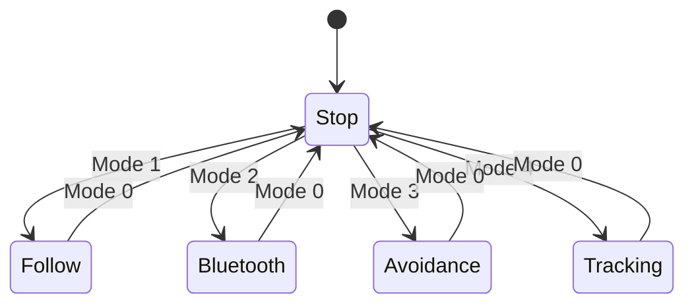

# STM32 Smart Car

基于 STM32F10x 学习套件二次开发与整理的智能小车项目。小车支持超声波跟随、蓝牙遥控、超声波避障和红外循迹，并通过 OLED 显示电池电压、距离和当前模式。

> A learning-oriented STM32F10x smart car project with line tracking, obstacle avoidance, ultrasonic following, Bluetooth control, and OLED status display.


## 项目说明与来源

本仓库是在公开学习套件、参考程序和配套硬件资料基础上完成的二次开发与学习整理，并非整套软硬件均由本人从零设计。仓库保留原理图、PCB、BOM、组装资料和工具，是为了便于复现。

原始资料的准确发布页面目前尚未核对完成；补充来源链接前，请勿将配套 PCB、软件工具或参考文档视为本人原创。

## 我的工作

- 完成 STM32F10x 工程的编译、烧录和整车联调
- 整合红外、超声波、蓝牙、电机、舵机、OLED、按键和 ADC 模块
- 调试五种运行状态及模式切换逻辑
- 根据距离和红外传感器输入调整车辆运动行为
- 整理程序、硬件、笔记和结构安装资料，补充复现说明

## 功能与状态



| 模式 | 行为 |
| --- | --- |
| `0` | 停止 |
| `1` | 根据超声波距离前进或后退，实现跟随 |
| `2` | 通过 USART3 接收蓝牙控制指令 |
| `3` | 舵机带动超声波模块扫描并选择避障方向 |
| `4` | 根据四路红外传感器状态修正循迹方向 |

OLED 实时显示 ADC 换算的电池电压、超声波距离和当前模式。

## 硬件与接口

| 模块 | 主要接口 |
| --- | --- |
| STM32F10x | 主控制器 |
| TB6612 电机驱动 | GPIO + Timer PWM |
| 超声波模块 | GPIO + Timer 输入捕获 |
| 四路红外传感器 | GPIO / EXTI |
| 蓝牙串口模块 | USART3 |
| OLED | I2C |
| 舵机 | Timer PWM |
| 电池电压采样 | ADC |

## 程序结构

```text
01程序资料/
  USER/main.c              主循环、模式和业务逻辑
  HARDWARE/                ADC、按键、LED、OLED、Timer 等驱动
  SYSTEM/                  延时、串口和系统配置
  STM32F10x_FWLib/         STM32 标准外设库
02笔记资料/                学习笔记
04小车PCB硬件资料.../      原理图、PCB、BOM 和 Gerber
05小车结构组装资料/        安装说明与实物图片
06使用的软件_APP等/        配套工具，仅作参考
```

## 构建与运行

### 环境

- Keil MDK
- STM32F10x Device Family Pack
- ST-Link 或兼容下载器
- 对应 STM32F10x 小车硬件

### 步骤

1. 打开 `01程序资料/USER/CAR.uvprojx`。
2. 检查目标芯片、下载算法和时钟配置。
3. 编译工程并通过 ST-Link 烧录。
4. 按硬件资料连接电机、红外、超声波、蓝牙、OLED 和舵机。
5. 抬起驱动轮完成方向与急停测试，再放到地面调试各模式。

## 已知问题

- 主循环使用阻塞式延时，执行动作期间对新指令的响应会变慢
- 多处重复读取超声波距离，可进一步缓存并增加滤波
- 红外循迹阈值和动作延时与场地、车速和传感器安装位置相关
- 原始资料来源链接、实物演示视频和完整引脚表仍待补充

## 使用说明

本项目用于嵌入式学习与二次开发展示。第三方参考程序、PCB、文档和工具的权利归原作者或发布方所有。
